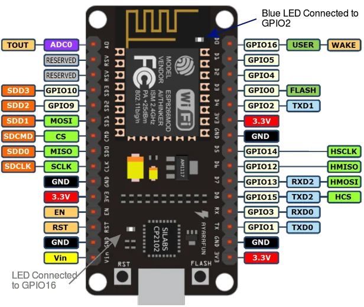

# 🧭 Guia de Pinagem do NodeMCU ESP8266

O NodeMCU ESP8266 é uma das placas mais populares para projetos de Internet das Coisas (IoT). Baseado no chip ESP8266, ele combina conectividade Wi-Fi com GPIOs versáteis, sendo ideal para automações, sensores e aplicações conectadas.

A seguir, você verá um **mapa completo da pinagem** do NodeMCU, com cores e funções bem definidas:




---

## 🔌 Alimentação

| Pino        | Função                        |
|-------------|-------------------------------|
| `Vin`       | Alimentação externa (5V DC)   |
| `3.3V`      | Saída regulada de 3.3V        |
| `GND`       | Terra (Ground)                |
| `EN`        | Enable: ativo em nível alto   |
| `RST`       | Reset: reinicia a placa       |

---

## 🧠 Pinos Digitais GPIO

| GPIO   | Função típica                       | Observações                                  |
|--------|-------------------------------------|----------------------------------------------|
| GPIO0  | Boot/entrada digital                | Usado na inicialização do ESP                |
| GPIO1  | TX (Serial)                         | Usado para comunicação serial (TXD0)         |
| GPIO2  | Saída digital / Boot                | Deve estar em HIGH no boot                   |
| GPIO3  | RX (Serial)                         | Usado para comunicação serial (RXD0)         |
| GPIO4  | Digital comum                       | Seguro para uso geral                        |
| GPIO5  | Digital comum                       | Seguro para uso geral                        |
| GPIO9  | Reservado (não recomendado)         | Pode causar instabilidade                    |
| GPIO10 | Reservado (não recomendado)         | Pode causar instabilidade                    |
| GPIO12 | MISO / Digital                      | Utilizado com SPI, seguro para uso geral     |
| GPIO13 | MOSI / Digital                      | Utilizado com SPI                            |
| GPIO14 | SCK / Digital                       | Utilizado com SPI                            |
| GPIO15 | Deve estar em LOW no boot           | Usado com SPI, mas cuidado na inicialização  |
| GPIO16 | Wake do modo deep sleep             | Também pode acionar um LED interno           |

> ⚠️ **Atenção:** GPIO0, GPIO2 e GPIO15 são pinos críticos durante o boot. Use com cautela!

---

## 📶 Comunicação Serial

| Pino     | Função           |
|----------|------------------|
| TXD0     | Transmissão UART |
| RXD0     | Recepção UART    |

---

## 🔄 SPI (Serial Peripheral Interface)

| Função | GPIO  |
|--------|--------|
| MISO   | GPIO12 |
| MOSI   | GPIO13 |
| SCK    | GPIO14 |
| CS     | GPIO15 |

---

## 💤 Wake e Deep Sleep

- **GPIO16** pode ser conectado ao pino **RST** para permitir que o ESP8266 acorde automaticamente do modo de **deep sleep**.
- Isso é útil em projetos alimentados por bateria.

---

## 🧪 Dica prática: LED interno

O LED interno geralmente está conectado ao **GPIO2** ou **GPIO16**, dependendo da versão da placa. No seu diagrama, o LED está em:

📍 **GPIO16 – LED conectado**

```cpp
digitalWrite(16, HIGH); // Apaga o LED
digitalWrite(16, LOW);  // Acende o LED
```

---

## ✅ Conclusão

O NodeMCU é uma placa poderosa e compacta, mas exige atenção especial à **função de boot** e **restrições de uso** de certos GPIOs. Este guia serve como referência rápida para prototipagem segura e eficiente com o ESP8266.

---

**Mestrado em Engenharia Eletrônica e Computação – UCPel**  
Dr. Rogério Albandes, Ph.D. in Computer Science · [Voltar para o README](../README.md)